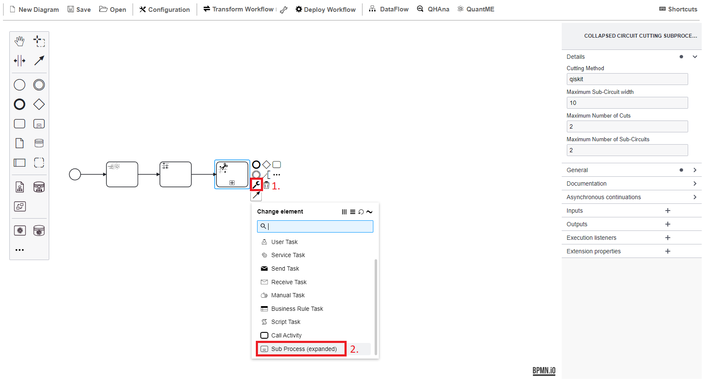

# Hands-On Session

In the following, we will guide you through all the steps required to model, deploy, and execute a hybrid quantum application using workflows.

The application is intended to automate route planning for package delivery drivers.
Thus, it includes splitting a graph with destinations to receive sub-graphs for each driver based on the truck capacity and the number and size of available packages.
For each driver, the optimal route is calculated for the sub-graph using the distances between the various destinations.

To solve this problem, the hybrid quantum application comprises classical pre- and post-processing steps, as well as the execution of two variational quantum algorithms.
Thereby, we will use the widely-known [Quantum Approximate Optimization Algorithm (QAOA)](https://arxiv.org/pdf/1411.4028.pdf).

The use case utilizes the Quantum Workflow Modeler and Quokka:

* [Quantum Workflow Modeler](https://github.com/PlanQK/workflow-modeler): A graphical BPMN modeler to define, transform, and deploy quantum workflows.
* [Quokka](https://github.com/UST-QuAntiL/Quokka): A microservice ecosystem enabling a service-based execution of quantum algorithms.

## Setup

The code required for the hands-on session is available [here](https://github.com/UST-QuAntiL/QuantME-UseCases/tree/master/2023-icwe).

As the hands-on session requires pushing your implementation from different steps to enable their reuse, start with forking the repository.
In the following, we will refer to the GitHub user to which the fork belongs as ``$GITHUB_USER``.

Afterwards, clone the repository and navigate to the ``2023-icwe`` folder:

```
git clone https://github.com/$GITHUB_USER/QuantME-UseCases.git
cd 2023-icwe
```

All components are available via Docker.
Therefore, these components can be started using the Docker-Compose file available [here](https://github.com/UST-QuAntiL/QuantME-UseCases/tree/master/2023-icwe/docker):

1. Update the [.env](https://github.com/UST-QuAntiL/QuantME-UseCases/tree/master/2023-icwe/docker/.env) file with your settings: 
  * ``PUBLIC_HOSTNAME``: Enter the hostname/IP address of your Docker engine. Do *not* use ``localhost``.
  * ``GITHUB_USER``: The GitHub user to which the fork belongs.

2. Run the Docker-Compose file:
```
docker-compose pull
docker-compose up --build
```
3. Wait until all containers are up and running. This may take some minutes.

Open the quantum workflow modeler using the following URL: ``$GITHUB_USER:8080``

Afterwards, the following screen should be displayed:


Familiarize yourself with the workflow modeler by dragging and dropping elements from the palette on the right into the modelling plain.

## Part 1: QAOA for MaxCut

In the first part of the hands-on session, you will model and execute a quantum workflow orchestrating the [Quantum Approximate Optimization Algorithm (QAOA)](https://arxiv.org/pdf/1411.4028.pdf) to solve the Maximum Cut (MaxCut) problem.
To model the quantum workflow, the [Quantum Modeling Extension (QuantME)](https://www.iaas.uni-stuttgart.de/publications/Weder2020_QuantumWorkflows.pdf), as well as its extension for Variational Quantum Algorithms (VQAs), called [QuantME4VQA](https://www.iaas.uni-stuttgart.de/publications/Beisel2023_QuantME4VQA.pdf), are used.

First, add a Warm-Starting Task after the initial start event.
[Warm-starting](https://www.mdpi.com/2079-9292/11/7/1033/pdf) is used to approximate a solution that is incorporated into the quantum circuit to facilitate the search for the optimal solution.
Select the Task icon in the palette (1), drag it into the plain, click on the wrench symbol (2), and select the QuantME Tasks category in the drop-down menu (3).
Finally, click on Warm-Starting Task within the QuantME Tasks category.


Configure the Warm-Starting Task using the values shown below.
Thereby, ``Initial State Warm-Start Egger`` is selected as the warm-starting method, which was introduced in [this paper](https://quantum-journal.org/papers/q-2021-06-17-479/).
Furthermore, we will use QAOA to solve the MaxCut problem, thus, select ``QAOA`` as the quantum algorithm to warm-start.
Finally, utilize the ``Goemans– Williamson`` algorithm to calculate the initial state to use, as well as ``10`` iterations to use for the approximation.


Next, add a second task of type Quantum Circuit Loading Task to load to parameterized QAOA circuit that is later executed in the variational loop.
The functionality to generate a corresponding quantum circuit is provided by Quokka, therefore, configure the task using ``quokka/maxcut`` as URL.
Furthermore, connect both tasks with the start event using sequence flow.


Due to today's restricted quantum computers, the quantum circuit should be [cut into multiple smaller sub-circuits](https://arxiv.org/pdf/2302.01792), thus, reducing the impact of errors, as well as the limited number of qubits.
Add a Circuit Cutting Subprocess, which is also available within the QuantME Tasks category.
This subprocess must contain the complete optimization loop of the VQA, indicating that the corresponding quantum circuit should be cut before execution and the result should be combined before further processing it.
Thereby, use ``qiskit`` as cutting method, utilizing the implementation provided by the [Circuit Knitting Toolbox](https://qiskit-extensions.github.io/circuit-knitting-toolbox/).
Additionally, restrict the maximum number of cuts, number of resulting sub-circuits, and their width as shown below:


Expand the Circuit Cutting Subprocess to model the optimization loop:



TODO

## Part 2: Creating a QuantME Replacement Model

TODO

## Part 3: Modeling and Executing the Hybrid Quantum Application

TODO
