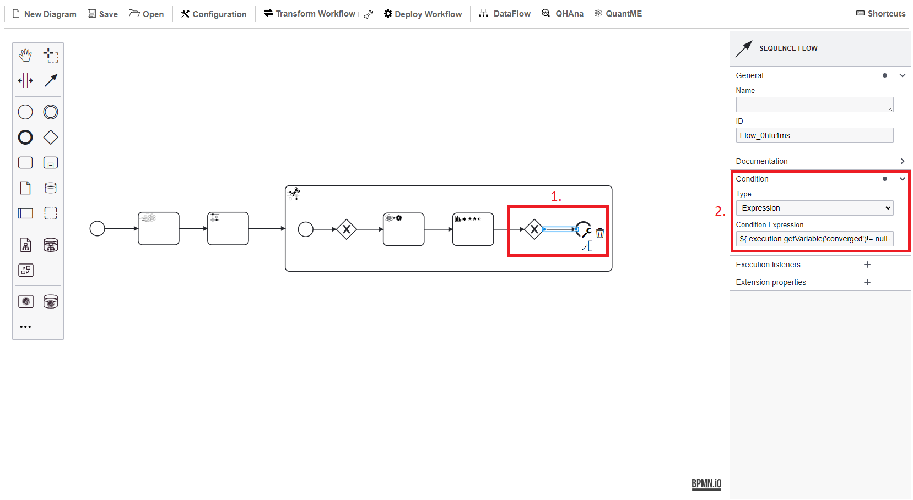
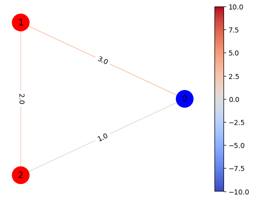
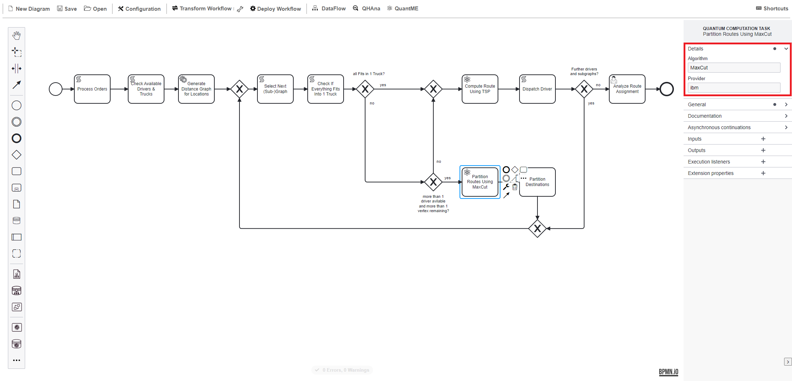

# Hands-On Session

In the following, we will guide you through all the steps required to model, deploy, and execute a hybrid quantum application using workflows.

The application is intended to automate route planning for package delivery drivers.
Thus, it includes splitting a graph with destinations to receive sub-graphs for each driver based on the truck capacity and the number and size of available packages.
For each driver, the optimal route is calculated for the sub-graph using the distances between the various destinations.

To solve this problem, the hybrid quantum application comprises classical pre- and post-processing steps, as well as the execution of two variational quantum algorithms.
Thereby, we will use the widely-known [Quantum Approximate Optimization Algorithm (QAOA)](https://arxiv.org/pdf/1411.4028.pdf).

The use case utilizes the Quantum Workflow Modeler and Quokka:

* [Quantum Workflow Modeler](https://github.com/PlanQK/workflow-modeler): A graphical BPMN modeler to define, transform, and deploy quantum workflows.
* [Quokka](https://github.com/UST-QuAntiL/Quokka): A microservice ecosystem enabling a service-based execution of quantum algorithms.

## Setup

The code required for the hands-on session is available [here](https://github.com/UST-QuAntiL/QuantME-UseCases/tree/master/2023-icwe).

As the hands-on session requires pushing your implementation from different steps to enable their reuse, start with **forking** the repository.
In the following, we will refer to the GitHub user to which the fork belongs as ``$GITHUB_USER``.

On Windows, you have to activate long paths for Git to enable cloning and pushing to this repository.
Thus, execute the following command:

```
git config --system core.longpaths true
```

Afterwards, clone the repository and navigate to the ``2023-icwe`` folder:

```
git clone https://github.com/$GITHUB_USER/QuantME-UseCases.git
cd QuantME-UseCases/2023-icwe
```

All components are available via Docker.
Therefore, these components can be started using the Docker-Compose file available [here](https://github.com/UST-QuAntiL/QuantME-UseCases/tree/master/2023-icwe/docker):

1. Update the [.env](https://github.com/UST-QuAntiL/QuantME-UseCases/tree/master/2023-icwe/docker/.env) file with your settings: 
  * ``PUBLIC_HOSTNAME``: Enter the hostname/IP address of your Docker engine. Do *not* use ``localhost``.
  * ``GITHUB_USER``: The GitHub user to which the fork belongs.

2. Run the Docker-Compose file:
```
cd docker
docker-compose pull
docker-compose up --build
```
3. Wait until all containers are up and running. This may take some minutes.

Open the quantum workflow modeler using the following URL: [localhost:8080](http://localhost:8080)

Afterwards, the following screen should be displayed:


Familiarize yourself with the workflow modeler by dragging and dropping elements from the palette on the right into the modeling pane.

If you are not familiar with BPMN, have a look at the [Camunda introduction](https://camunda.com/bpmn/).

## Part 1: QAOA for MaxCut

In the first part of the hands-on session, you will model and execute a quantum workflow orchestrating the [Quantum Approximate Optimization Algorithm (QAOA)](https://arxiv.org/pdf/1411.4028.pdf) to solve the Maximum Cut (MaxCut) problem.
To model the quantum workflow, the [Quantum Modeling Extension (QuantME)](https://www.iaas.uni-stuttgart.de/publications/Weder2020_QuantumWorkflows.pdf), as well as its extension for Variational Quantum Algorithms (VQAs), called [QuantME4VQA](https://www.iaas.uni-stuttgart.de/publications/Beisel2023_QuantME4VQA.pdf), are used.

First, add a Warm-Starting Task after the initial Start Event.
[Warm-starting](https://www.mdpi.com/2079-9292/11/7/1033/pdf) is used to approximate a solution that is incorporated into the quantum circuit to facilitate the search for the optimal solution.
Select the Task icon in the palette (1), drag it into the pane, click on the wrench symbol (2), and select the QuantME Tasks category in the drop-down menu (3).
Finally, click on Warm-Starting Task within the QuantME Tasks category.


Configure the Warm-Starting Task using the values shown below.
Thereby, ``Initial State Warm-Start Egger`` is selected as the warm-starting method, which was introduced in [this paper](https://quantum-journal.org/papers/q-2021-06-17-479/).
Furthermore, we will use QAOA to solve the MaxCut problem, thus, select ``QAOA`` as the quantum algorithm to warm-start.
Finally, utilize the ``GW`` algorithm to calculate the initial state to use, as well as ``10`` iterations to use for the approximation.


Next, add a second task of type Quantum Circuit Loading Task to load to parameterized QAOA circuit that is later executed in the variational loop.
The functionality to generate a corresponding quantum circuit is provided by Quokka, therefore, configure the task using ``quokka/maxcut`` as URL.
Furthermore, connect both tasks with the start event using sequence flow.


Due to today's restricted quantum computers, the quantum circuit should be [cut into multiple smaller sub-circuits](https://arxiv.org/pdf/2302.01792), thus, reducing the impact of errors, as well as the limited number of qubits.
Add a Circuit Cutting Subprocess, which is also available within the QuantME Tasks category.
This subprocess must contain the complete optimization loop of the VQA, indicating that the corresponding quantum circuit should be cut before execution and the result should be combined before further processing it.
Thereby, use ``qiskit`` as cutting method, utilizing the implementation provided by the [Circuit Knitting Toolbox](https://qiskit-extensions.github.io/circuit-knitting-toolbox/).
Additionally, restrict the maximum number of cuts, number of resulting sub-circuits, and their width as shown below:


Expand the Circuit Cutting Subprocess to model the optimization loop:


First, add a Start Event for the subprocess and afterwards an Exclusive Gateway to later join the sequence flow of the optimization loop.
The first task within this loop is of type Quantum Circuit Execution Task to execute the loaded quantum circuit on a quantum computer.
For this example, we configure the task to use ``ibm`` as quantum hardware provider and the ``aer_qasm_simulator`` as QPU.
The aer_qasm_simulator is a simulator that can be executed locally to avoid queuing times.
Furthermore, the number of shots, i.e., the number of executions, is set to ``2000``, and it is specified that the circuit to execute was implemented using ``qiskit``.


Executing a quantum circuit returns a probability distribution of different measured bit strings.
However, these bit strings must be evaluated to assess the quality of the solution they represent for the given problem.
For this, QuantME4VAR introduced the Result Evaluation Task.
Configure the task to use the ``Expectation Value`` as the objective function and ``maxcut`` as the cost function to assess the results.


Afterwards, a second Exclusive Gateway is added to check if the results already converge.
If this is the case, the subprocess terminates with an End Event.
To evaluate the condition add the following expression to the sequence flow between the Result Evaluation Task and the End Event as also shown below: ``${ execution.getVariable('converged')!= null && execution.getVariable('converged') == 'true'}``



If the results do not yet converge, the next iteration is entered by classically optimizing the parameters for the parameterized QAOA circuit.
This is done by a Parameter Optimization Task using the ``Cobyla`` optimizer.
All other attributes are optional and left empty for this example.


Furthermore, another condition has to be added for the second outgoing sequence flow of the Exclusive Gateway: ``${ execution.getVariable('converged')== null || execution.getVariable('converged') == 'false'}``


To finalize the subprocess, connect the Parameter Optimization Task with the first Exclusive Gateway using sequence flow.

The Result Evaluation Task generates an image to visualize the identified MaxCut.
Thus, add a User Task (1) to analyze this image and afterwards terminate the workflow using an End Event.
Configure the User Task with a form of type ``Generated Task Forms`` and add a form field to display the URL of the result image as shown below:


Next, the quantum workflow can be tested using the Camunda Engine.
For this, click into the modeling pane (without clicking on a modeling construct) and then mark the process as ``Executable``:


Before continuing, store your modeled workflow locally using the ``Save`` button on the top-left.

To execute the workflow, the QuantME and QuantME4VAR modeling constructs must be replaced by standard-compliant BPMN modeling constructs.
Therefore, click on the ``Transform Workflow`` button.
The resulting native workflow model is displayed below.
For example, the Warm-Starting Task and Quantum Circuit Loading Task are replaced by two Service Tasks invoking the corresponding services of the Quokka ecosystem based on the configuration attributes.
Additionally, new Service Tasks are inserted to split the quantum circuit, as well as to combine the results after the execution.


In case you experience any problems, the workflow model before transformation is available [here](https://github.com/UST-QuAntiL/QuantME-UseCases/blob/master/2023-icwe/part1/part1-before-transformation.bpmn), which can be opened in the modeler to continue from this point.
Furthermore, the final executable workflow can be accessed [here](https://github.com/UST-QuAntiL/QuantME-UseCases/blob/master/2023-icwe/part1/part1-executable-workflow.bpmn).

To upload the workflow to the Camunda Engine, click on the ``Deploy Workflow`` button:


Open the Camunda Engine using the following URL: [localhost:8090](http://localhost:8090)
Use ``demo`` as username and password to log in, which displays the following screen:


Click on ``Cockpit`` to validate that the workflow was successfully uploaded.
Then, click on ``Processes`` on the top-left and select the workflow from the list.
This should show a graphical representation of the uploaded workflow:


To instantiate the workflow, click the home button on the top-right, then select ``Tasklist``.
Next, click on ``Start process`` on the top-right, select the name of the uploaded workflow, and provide the input parameters as shown below:

* ``adjMatrix``: ``[[0,2,1],[3,0,1],[1,2,0]]``
* ``betas``: ``[1]``
* ``gammas``: ``[1]``
* ``token``: ``YOUR_IBMQ_TOKEN`` (can be left empty when using the aer simulator (default))


Switch back to the Camunda Cockpit, and select the deployed workflow.
Then, a running process instance should be shown on the bottom.
Click on the ID of the instance to visualize the current variables, as well as the position of the token.
Check the variables to trace the current iteration, as well as costs of the optimization process.


Wait until the token reaches the final user task, then, switch to the Tasklist.
Select the task item on the left (1), then click on ``Claim`` to activate the item (2), and download the result plot using the given URL (3).
Afterwards, click on ``Complete`` to terminate the workflow instance (4).


Finally, open the downloaded image, visualizing the MaxCut solution for the input graph.



## Part 2: Creating a QuantME Replacement Model

In the second part of the tutorial, we will discuss how to provide the implementation of part 1 as a reusable artifact, which can be integrated into other workflows.
For this, the concept of [QuantME Replacement Models (QRMs)](https://www.iaas.uni-stuttgart.de/publications/Weder2020_QuantumWorkflows.pdf) is utilized.
A QRM enables to replace a QuantME task by a reusable workflow fragment implementing its functionality.
The transformation in part 1 was also based on QRMs, e.g., replacing the Warm-Starting Task and Quantum Circuit Loading Task by corresponding Service Tasks.
Thereby, a QRM consists of a so-called ``detector``, which is used to identify QuantME tasks that can be replaced, and a ``replacement fragment`` implementing the required functionality.

Next, we will implement a QRM using the previously implemented workflow as the replacement fragment.
To abstractly model a complete quantum algorithm as a single task within a workflow, QuantME provides the Quantum Computation Task.
Thus, a Quantum Computation Task configured to execute QAOA for MaxCut can be replaced by our previous workflow.
Start with creating a new diagram to model the detector for the QRM.
The detector contains exactly one Quantum Computation Task, thus, remove the initial Start Event and add the task to the modeling pane:


Configure the Quantum Computation Task to specify the attributes of the tasks that can be replaced by this QRM:

* ``Algorithm``: ``MaxCut``
* ``Provider``: ``ibm``

Store the file locally as ``detector.bpmn``.
Create a new folder in the [qrm folder](https://github.com/UST-QuAntiL/QuantME-UseCases/tree/master/2023-icwe/qrms) of your fork, called ``vqa-maxcut``, and add the detector to this folder.
Load the workflow from part 1 into the modeler, which is used as the baseline for the replacement of the QRM.
Remove the user task and wrap all modeling construct into a subprocess, resulting in the following workflow:


Store the file locally as ``replacement.bpmn``, and move it to the same folder as the detector.
Commit the two files to your fork of the use case repository.
The two files are available [here](https://github.com/UST-QuAntiL/QuantME-UseCases/tree/master/2023-icwe/part2) for your references.

Create a new diagram to test your QRM.
For this, add a Start Event, a Quantum Computation Task configured the same way as the connector, and an End Event:


To enable the transformation of the workflow, the newly created QRM must be loaded into the workflow modeler.
Thus, click on ``QuantME`` on the top-right and afterwards on ``Update QRMs``.


Next, transform the workflow as described in part 1 of the tutorial.
In case the transformation fails, wait for one minute and then reload the QRMs again, as they are fetched via the GitHub API, which takes some time to provide the new files.
The result of the first transformation step should look as follows:


However, the workflow still contains QuantME modeling constructs, which can not be executed by the Camunda engine.
Therefore, trigger a second transformation using the ``Transform Workflow`` button.
This results in the executable workflow model shown below:


Test your workflow as described in part 1 of the tutorial.
Thereby, make sure to set the ``Executable`` flag for the workflow to enable its deployment to the Camunda engine.

## Part 3: Modeling and Executing the Hybrid Quantum Application

In the third part of the tutorial, we will employ the previously modeled quantum algorithm to automate the route planning for package delivery drivers.
In addition to the QAOA for MaxCut algorithm modeled in part 1 of this tutorial, we use another QAOA for solving a traveling salesman problem (TSP).
Moreover, program flow and various classical tasks for processing are required.

The [part3](https://github.com/UST-QuAntiL/QuantME-UseCases/tree/master/2023-icwe/part3) folder of your fork contains a prepared workflow model ``ICWE23_routeplaning.bpmn``, in which the QRM for QAOA for MaxCut from part 2 of this tutorial can be integrated.
Hence, open this workflow model in your modeler.


The Start Event of the workflow enables the user to submit a list of packages and their destinations, as well as a list of trucks that are available to distribute them.

In the first Script Task ``Process Orders``, the orders are retrieved from the data source defined by the user and are subsequently processed, such that information about all packages' destinations and sizes is stored in the workflow engine. 

Next, in the ``Check Available Drivers & Trucks`` Script Task, information about the availability of delivery trucks, such as their capacity, is retrieved from the defined data source and stored in the workflow engine. 

Afterwards, a Service Task is used to dynamically generate a distance matrix of all package delivery destinations on the basis of the Google Maps API.

The next part of the workflow defines the logic for distributing the packages and computing delivery routes.
As typically, one truck and a single route are insufficient to distribute all packages, routes are computed iteratively in a loop.
First, the destinations which shall be processed in the current iteration are selected in the ``Select Next (Sub-)Graph`` Script Task. In the first iteration of the loop, all destinations are included.
Next, it is checked if all packages for the currently selected destination fit into one truck. 
If this is the case, a Quantum Computation Task is used to compute the optimal route for the delivery truck solving a TSP using QAOA. 
Afterwards, the truck driver is dispatched on the computed route, and it is checked, if there are more drivers available and packages that need to be delivered.
In the case that not all packages fit into one truck, it is checked if there are still multiple truck drivers available and if the set of current destinations includes more than one element and hence, can be further divided.
If this is the case, we employ the previously generated QRM (see part 2) to partition the set of current destinations into two sets, which each contain close by destinations.
After the Quantum Computation Task, a Script Task post-processing the quantum algorithm results and storing them in the workflow engine is executed.

To complete the described workflow model, the previously generated QRM still needs to be integrated.
Thus, click on the ``Partition Routes Using MaxCut`` Quantum Computation Task and insert the previously defined configuration into the ``Details`` tab.

* ``Algorithm``: ``MaxCut``
* ``Provider``: ``ibm``



Finally, the complete workflow model can be transformed, deployed, and executed as described in part 1 of this tutorial.
For the required input parameters for the workflow execution corresponding default values are already inserted and can be overwritten when creating the workflow instance via the Camunda Tasklist.
The Quokka circuit cutting service uses the [IBM circuit knitting toolbox](https://github.com/Qiskit-Extensions/circuit-knitting-toolbox), requires a token to successfully cut larger quantum circuits.
This token can be retrieved free of charge using an academic account.
If you do not want to retrieve a token, a smaller problem instance can be solved, which is available [here](https://github.com/UST-QuAntiL/QuantME-UseCases/blob/master/2023-icwe/data/packages_small.txt).
Thus, adapt the input parameter to us ``packages_small.txt`` instead of ``packages.txt``.

To shut down all Docker containers started throughout this tutorial, execute the following command in the docker folder of your forked repository:
```
docker-compose down
```
